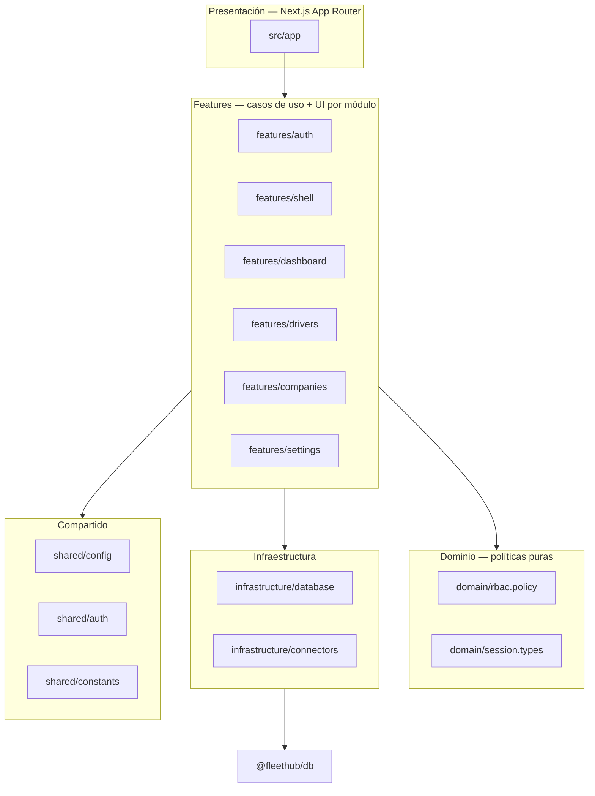

# FleetHub — Arquitectura del monorepo

Este documento describe la **estructura enterprise** del código: capas, paquetes y reglas de dependencia.

## Diagrama de capas (web)



## Reglas de dependencia

| Desde | Puede importar |
|-------|----------------|
| `app/` | `features/*`, `shared/*` (tipos), casi nunca `@fleethub/db` directamente |
| `features/*` | `domain/*`, `infrastructure/*`, `shared/*`, `@fleethub/contracts` |
| `domain/*` | Solo tipos / Prisma **type-only** si hace falta; sin `next/*`, sin `react` |
| `infrastructure/*` | `@fleethub/db`, `@fleethub/contracts` |
| `shared/*` | Librerías neutras; `shared/auth/secret` sin `server-only` para **Edge middleware** |

## Paquetes npm (`packages/*`)

| Paquete | Responsabilidad |
|---------|-----------------|
| `@fleethub/tsconfig` | Bases TS estrictas (`base`, `nextjs`, `node`) |
| `@fleethub/contracts` | Tipos compartidos web/worker: `Result`, `FleetConnector`, DTOs de integración |
| `@fleethub/db` | Prisma, `withTenant`, migraciones, seed, RLS SQL |
| `@fleethub/auth` | Login JWT, cookies de sesión compartidas entre web y API (subpaths Edge-safe: `secret`, `constants`) |

## Apps (`apps/*`)

| App | Rol |
|-----|-----|
| `@fleethub/web` | UI SaaS tenant; `/api/*` del navegador se reescribe en `next.config.ts` hacia `NEXT_PUBLIC_SERVER_URL` |
| `@fleethub/server` | API HTTP (auth, futuro REST); **obligatorio** para que `/api/*` funcione |
| `@fleethub/worker` | Colas BullMQ, sync Uber/FreeNow (Hito 3+) |

## Convención de carpetas (`apps/web/src`)

```
src/
  app/                 # Solo rutas; páginas delgadas que delegan en features
  domain/              # Políticas y tipos de dominio (sin I/O)
  features/<name>/
    server/            # Servicios y queries "use server" / server-only
    ui/                # Componentes cliente del feature
  infrastructure/     # DB facade, contratos de conectores
  shared/              # Config, constantes, utilidades sin lógica de negocio
  middleware.ts
```

## Calidad

- **ESLint**: `apps/web/eslint.config.mjs` (Next + Prettier).
- **Prettier**: raíz `prettier.config.mjs`; `npm run format`.
- **Typecheck**: `npm run typecheck` en workspaces que lo expongan.

## Variables de entorno (resumen)

| Variable | Dónde se usa |
|----------|----------------|
| `NEXT_PUBLIC_APP_URL` | `app/layout.tsx` (`metadataBase`), `shared/config/public-env.ts`, UI de depuración |
| `NEXT_PUBLIC_SERVER_URL` | **Obligatoria en Next** — `next.config.ts` (rewrites `/api/*`), `public-env.ts` → `getFleetHubServerUrl()` / `buildApiUrl()` en servidor |
| `AUTH_SECRET` | Web + API: JWT de sesión (`@fleethub/auth`, `shared/auth/secret.ts`) |
| `WEB_ORIGIN` | API (`apps/server`): CORS para el origen del navegador |
| `DATABASE_URL` | Prisma (`packages/db`); en `apps/web/.env.local` suele ser rol `fleethub_app` (RLS) |
| `REDIS_URL` | Worker (`apps/worker/src/config/env.ts`) |

## Próximos pasos (Hito 3)

- Implementaciones `FleetConnector` en `apps/worker` (o `packages/connectors-uber`) registradas desde un **registry** en `infrastructure/connectors`.
- Jobs BullMQ que llaman a conectores y persisten en `trips` vía `@fleethub/db` + `withTenant`.
