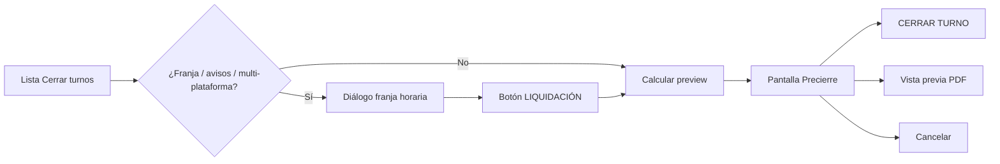

# FleetHub — Mejoras operativa: Precierre, Excel y cancelaciones pagadas

**Para:** Cliente (operador de flota)  
**De:** FleetHub  
**Fecha:** Julio 2026  
**Versión:** 3.2

---

## 1. Resumen ejecutivo

Este documento recoge el paquete de mejoras operativas acordado con el cliente en julio 2026. **Ningún ítem está desplegado en producción todavía**; todo el alcance figura como pendiente de desarrollo y entrega tras aceptación.

| Código | Mejora | Estado | Importe (IVA no incl.) |
|--------|--------|--------|-------------------------|
| **M1** | Flujo **Liquidación → Precierre → Cerrar / PDF** | ⏳ **Pendiente** | Incl. bloque A |
| **M2** | Pantalla **Precierre** (viajes + facturación + pagos + importe total) | ⏳ **Pendiente** | Incl. bloque A |
| **M3** | Excel: **Taxímetro** + **Com. plataforma**; sin columna Avisos | ⏳ **Pendiente** | Incl. bloque A |
| **M4** | **Cancelaciones pagadas** Uber + FreeNow + backfill histórico | ⏳ **Pendiente** | Incl. bloque B |

| | |
|---|---|
| **Bloque A** — M1 + M2 + M3 | **300 €** · plazo 3–5 días laborables |
| **Bloque B** — M4 cancelaciones | **200 €** · plazo 5–8 días laborables |
| **Presupuesto total del proyecto** | **500 €** |
| **Pago** | Por hitos — ver §10 |

---

## Parte I — Pendiente de implementar (M1, M2, M3)

### 2. Problemas a resolver (bloque A)

| Área | Qué ocurría | Impacto |
|------|-------------|---------|
| Cierre de turnos | Al pulsar **CERRAR TURNO** o **LIQUIDACIÓN**, el sistema cerraba **sin pantalla intermedia** | No se podía revisar importes ni generar PDF antes de cerrar |
| Precierre | No había resumen operativo ni lista de viajes incluidos | Cierre a ciegas; difícil validar franjas parciales |
| Excel | Faltaban Taxímetro y Com. plataforma; sobraba columna Avisos | Cuadre manual con hojas externas |

**Causa técnica (M1):** la UI llamaba a `liquidation-preview` y acto seguido a `close`, sin abrir el diálogo de Precierre que ya existía en código.

---

### 3. M1 — Flujo de liquidación restaurado

**Estado:** ⏳ Pendiente de implementación



| Paso | Operador | Sistema |
|------|----------|---------|
| 1 | **CERRAR TURNO** | Abre franja si aplica (varios días, avisos, multi-plataforma) |
| 2 | **LIQUIDACIÓN** | Calcula preview; **no cierra** |
| 3 | **Precierre** | Resumen + viajes seleccionados |
| 4 | PDF / **CERRAR TURNO** / Cancelar | PDF, cierre con nota, o vuelta a lista |

**Validaciones:** cierre bloqueado si hay pagos sin confirmar o desglose descuadrado (app + efectivo + tarjeta ≠ importe).

**APIs:**

| Método | Ruta |
|--------|------|
| `POST` | `/api/tenant/shifts/liquidation-preview` |
| `GET` | `/api/tenant/shifts/liquidation-pdf` |
| `POST` | `/api/tenant/shifts/close` |

Parámetros opcionales: `platform`, `timeFrom`, `timeTo` (cierre parcial por franja).

---

### 4. M2 — Pantalla Precierre (boceto operativo)

**Estado:** ⏳ Pendiente de implementación

| Bloque | Contenido |
|--------|-----------|
| Cabecera | Conductor, empresa, N viajes, periodo |
| **Viajes seleccionados** | Tabla: fecha/hora, tarifa, plataforma, importe bruto |
| **Facturación total** | Taxímetro + Tarifa 3 (T3) |
| **Pagos** | Fuera app (efectivo + tarjeta) + Pago app |
| **Propinas** | Total del pack de viajes |
| **Importe total (bruto)** | Suma bruta del cierre |
| **Total a liquidar al conductor** | Importe neto de caja |
| Detalle liquidación *(desplegable)* | IVA, reparto, primas, comisión, peajes |

**Reglas taxímetro vs T3:** taxímetro suma bruto salvo T3 y líneas solo propina; T3 suma solo precio cerrado. Misma lógica que Facturación y Excel.

La API preview devuelve totales (`taximetroCents`, `t3Cents`, `grossCents`, …) y array `trips[]` con cada viaje incluido en el cierre.

---

### 5. M3 — Exportación Excel

**Estado:** ⏳ Pendiente de implementación

| Antes | Después |
|-------|---------|
| Columna Avisos en Excel | Eliminada *(sigue en pantalla)* |
| Sin Taxímetro | Columna **Taxímetro** |
| Sin comisión | Columna **Com. plataforma** |

Afecta a `cerrar-turnos.xlsx` y `turnos-cerrados.xlsx`. Totales alineados con la tabla en pantalla (`tripTaximetroCents`, `resolveTripFeeCents`).

**Columnas Excel (orden):** Empresa · Plataformas · Conductor · Viajes · Importe total · **Taxímetro** · Tarifa 3 · Pago App · Efectivo · Tarjetas · **Com. plataforma** · Propinas · Primas · Peajes *(+ Fecha en turnos cerrados)*.

---

### 6. Validación bloque A (checklist tras entrega)

*A ejecutar por el cliente una vez desplegado el bloque A.*

1. **Flujo:** CERRAR TURNO → (franja) → **LIQUIDACIÓN** → **Precierre** → PDF y/o CERRAR TURNO.  
2. **Precierre:** Facturación total, Pagos, Propinas e importe bruto cuadran con caja.  
3. **Viajes seleccionados:** tabla coherente con franja / último viaje elegido.  
4. **Excel:** Taxímetro y Com. plataforma = pantalla.  
5. Confirmación escrita para facturación bloque A (hitos §10.1).

---

## Parte II — Pendiente de implementar (M4)

### 7. M4 — Cancelaciones pagadas no reflejadas

**Estado:** ⏳ Pendiente de implementación

#### 7.1 Problema reportado

| Síntoma | Impacto |
|---------|---------|
| En portal Uber/FreeNow aparece importe por cancelación (compensación al conductor). | El operador ve el cobro en plataforma. |
| En FleetHub no existe ese servicio / no suma en totales. | Descuadre en facturación, cierre de caja y liquidación. |
| Puede afectar a varios conductores y días. | Diferencias acumuladas difíciles de detectar. |

#### 7.2 Causa técnica (confirmada)

FleetHub importa **servicios completados** como registros `trips`. Las cancelaciones con importe **quedan fuera** del flujo de ingesta.

| Plataforma | Qué se importa hoy | Qué se descarta |
|------------|-------------------|-----------------|
| **Uber** | Viajes *completed* / *completado* en activity y pagos. | Cancelaciones, compensaciones en columnas de cancelación del CSV de pagos. |
| **FreeNow** | Reservas `ACCOMPLISHED`. | Reservas `CANCELED` aunque haya compensación en portal o en earnings `cancellations`. |

En FreeNow las cancelaciones solo alimentan **KPIs operativos** (rechazos), no facturación ni liquidación.

**Por qué ocurre:** la cancelación pagada es un evento económico distinto (sin fin de servicio, importe en columnas específicas, earnings agregados). FleetHub **no implementó** esa variante; el sync puede estar en verde y aun así faltar dinero.

**Qué no es:**

- No es fallo de credenciales ni sync puntual.  
- No es sync lenta Uber multi-organización.  
- No es viaje PARTIAL (importe pendiente de publicar).  
- No se corrige reiniciando worker ni sync manual.

#### 7.3 Solución propuesta

Registrar cancelaciones pagadas como **líneas de servicio** visibles en:

- Listado de viajes del conductor  
- Facturación y totales por periodo  
- Cierre de turnos y Precierre (misma lógica app/efectivo/tarjeta)  
- Exportaciones Excel/PDF  

| Campo | Valor propuesto |
|-------|-----------------|
| Identificador | ID plataforma + sufijo estable (p. ej. `::cancel`) |
| Tipo / tarifa | «Cancelación (Uber)» / «Cancelación (FreeNow)» |
| Fecha | Solicitud o abono — regla acordada con cliente |
| Importes | Bruto, comisión y neto según informe plataforma |
| Cobro | App / efectivo / tarjeta según portal |

**Uber:**

1. Leer compensaciones en informes Payments Order / Payments Driver (columnas cancelación ES/EN).  
2. Aceptar estados ≠ *completed* cuando cancelación > 0.  
3. Tipo de tarifa dedicado; evitar duplicados activity + payments.

**FreeNow:**

1. Detectar `CANCELED` con compensación (booking o cruce earnings `cancellations`).  
2. Importar solo importe > 0.  
3. Misma visibilidad que Uber en facturación y cierre.

**Backfill:** re-sync ventana acordada (propuesta: desde 01/06/2026 o 90 días) + informe reconciliación por tenant/conductor/día + validación 2–3 conductores ejemplo.

**UI (mínimo):** etiqueta «Cancelación» en listados y facturación, sin rediseño de pantallas.

#### 7.4 Entregables M4

| # | Entrega |
|---|---------|
| E1 | Conector Uber: ingesta cancelaciones pagadas |
| E2 | Conector FreeNow: ingesta cancelaciones pagadas |
| E3 | Tests automáticos CSV/API |
| E4 | Backfill histórico + informe reconciliación |
| E5 | Despliegue producción |
| E6 | Nota de cierre con casos verificados |

#### 7.5 Plazo M4

| Fase | Duración |
|------|----------|
| Análisis con 2–3 ejemplos reales del cliente | 1 día |
| Desarrollo Uber + FreeNow + tests | 2–3 días |
| Backfill + validación | 1–2 días |
| Despliegue y verificación | 1 día |
| **Total** | **5–8 días laborables** |

*Arranca al recibir al menos un ejemplo verificado por plataforma (captura + conductor + fecha).*

#### 7.6 Qué necesitamos del cliente (M4)

1. **2–3 casos Uber** — conductor, fecha, importe portal, captura.  
2. **2–3 casos FreeNow** — mismo detalle.  
3. Fecha de servicio en FleetHub: ¿solicitud o día de abono?  
4. Ventana de backfill: ¿90 días o desde fecha concreta?  
5. ¿Las cancelaciones entran en cierre de turnos igual que un viaje app?

---

## 10. Presupuesto total e hitos de pago

### 10.1 Resumen presupuestario

| Bloque | Alcance | Estado | Importe |
|--------|---------|--------|---------|
| **A** | M1 + M2 + M3 — Precierre, liquidación, Excel | ⏳ Pendiente | **300 €** |
| **B** | M4 — Cancelaciones Uber/FreeNow + backfill | ⏳ Pendiente | **200 €** |
| | **TOTAL PROYECTO** | | **500 €** |

IVA no incluido. Fuera de alcance bloque B: ERP del cliente, rediseño UI avanzado, histórico anterior a ventana acordada sin presupuesto adicional.

### 10.2 Hitos — Bloque A (300 €)

| Hito | Contenido | Importe | % |
|------|-----------|---------|---|
| **A0** | Aceptación documento + arranque desarrollo | 60 € | 20 % |
| **A1** | Desarrollo M1–M3 + despliegue producción | 120 € | 40 % |
| **A2** | Validación cliente (§6) + cierre bloque A | 120 € | 40 % |
| | **Subtotal A** | **300 €** | 100 % |

### 10.3 Hitos — Bloque B (200 €)

| Hito | Contenido | Importe | % |
|------|-----------|---------|---|
| **B0** | Aceptación + recepción casos ejemplo (§7.6) | 40 € | 20 % |
| **B1** | Desarrollo y tests Uber + FreeNow | 80 € | 40 % |
| **B2** | Backfill + informe reconciliación | 60 € | 30 % |
| **B3** | Producción + validación con cliente | 20 € | 10 % |
| | **Subtotal B** | **200 €** | 100 % |

### 10.4 Calendario orientativo

| Momento | Acción |
|---------|--------|
| Tras aceptación | Pago hito **A0** → desarrollo bloque A (3–5 días) |
| Tras despliegue A | Validación §6 → hitos **A1** / **A2** |
| Tras B0 + casos | Desarrollo M4 (5–8 días) → hitos **B1–B3** |
| Tras B3 | Proyecto completo — **500 €** |

---

## 11. Anexo técnico — API liquidación (prevista en M1)

### Preview

```http
POST /api/tenant/shifts/liquidation-preview
{ "driverId": "…", "platform": "FREENOW", "timeFrom": "…", "timeTo": "…" }
```

### Cierre

```http
POST /api/tenant/shifts/close
{ "driverId": "…", "tripIds": ["…"], "note": "…" }
```

### PDF

```http
GET /api/tenant/shifts/liquidation-pdf?driverId=…&tripIds=…
```

---

## 12. Próximos pasos

1. Cliente confirma aceptación del documento y presupuesto **500 €**.  
2. Pago hito **A0** → desarrollo y despliegue **M1–M3**.  
3. Validación bloque A (§6) → hitos **A1–A2**.  
4. Cliente envía casos cancelación (§7.6) → hito **B0** → **M4** → **B1–B3**.

---

## 13. Historial

| Versión | Cambio |
|---------|--------|
| 1.0–1.1 | Borrador Precierre + Excel; presupuesto 1.500 € |
| 2.0 | Documento único bloque A |
| 3.0 | M4 cancelaciones; total 2.700 € |
| 3.1 | M1–M3 marcados pendientes; alineado con producción |
| 3.2 | Presupuesto total **500 €** (A 300 € + B 200 €) |

---

*Documento preparado por FleetHub — Julio 2026.*
