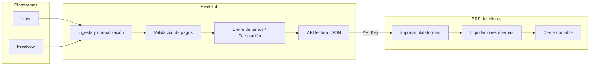

# FleetHub — Propuesta de integración con ERP de liquidaciones

**Documento para revisión del cliente**  
**Versión:** 1.0 · Julio 2026  
**Ámbito:** API de lectura JSON + autenticación por API Key para consumo desde ERP externo

---

## 1. Resumen ejecutivo

FleetHub **ya dispone** de los datos de plataformas (Uber, FreeNow, Bolt, Cabify) necesarios para alimentar vuestro ERP de liquidaciones: viajes, importes, desglose app/efectivo/tarjeta, propinas, peajes, primas, comisiones, conductor, empresa y plataforma.

Lo que **falta hoy** es exponer esos datos en una **API de lectura JSON** con **API Key**, para que el ERP los consuma de forma automática (botón «Actualizar plataformas» o sincronización programada).

**FleetHub no sustituye** vuestras liquidaciones internas ni la lógica de cierre en caja del ERP. Solo actúa como **fuente de verdad de datos de plataformas** ya normalizados y agregados.

| Concepto | Plazo orientativo |
|----------|-------------------|
| **MVP de integración** | 1–2 semanas desde acuerdo de requisitos |
| **Entregable principal** | API REST JSON + API Key + documentación OpenAPI |
| **Presupuesto MVP** | **7.000 €** (IVA no incluido) — ver §7 y §10 |

---

## 2. Objetivo

Permitir que el ERP del cliente:

1. **Consulte** viajes y totales de facturación por periodo, conductor, día y plataforma.
2. **Importe** esos datos con un flujo tipo «Actualizar plataformas» o cron nocturno.
3. **Mantenga** en el ERP toda la lógica propia de liquidación, reparto conductor/empresa, IVA y cierre contable.

FleetHub seguirá siendo el sistema donde se **validan pagos**, se **cierran turnos en caja** y se **monitoriza la ingesta** desde Uber/FreeNow. El ERP recibe una **copia de lectura** de los datos ya consolidados.

---

## 3. División de responsabilidades



| Responsabilidad | FleetHub | ERP cliente |
|-----------------|----------|-------------|
| Conectar con Uber / FreeNow | ✓ | — |
| Normalizar viajes y cobros | ✓ | — |
| Validar tipo de pago (app/efectivo/tarjeta) | ✓ | — |
| Cerrar turnos en caja (operativa flota) | ✓ | — |
| Pantalla Facturación y export Excel | ✓ | — |
| Reparto conductor / empresa (% neto, primas, comisión) | Configurable en FleetHub para cierre de turno | **Lógica principal en ERP** |
| Liquidaciones internas y nóminas | — | ✓ |
| Cierre contable / asientos | — | ✓ |
| Consumir datos vía API | Expone API | ✓ |

---

## 4. Qué datos tiene FleetHub hoy

### 4.1 Por viaje (`trips`)

Cada viaje ingresado desde plataforma incluye, como mínimo:

| Campo | Descripción | Uso ERP |
|-------|-------------|---------|
| `id` | Identificador interno FleetHub | Referencia cruzada |
| `externalTripId` | ID del viaje en la plataforma | Conciliación |
| `platform` | `UBER`, `FREENOW`, `BOLT`, `CABIFY` | Filtro / dimensión |
| `startedAt`, `endedAt` | Fecha/hora inicio y fin (Europe/Madrid) | Periodo contable |
| `fareType` | Tipo tarifa (incl. Tarifa 3 / precio cerrado) | Desglose T3 |
| `grossAmountCents` | Importe bruto | Facturación total |
| `platformFeeCents` | Comisión plataforma | Comisiones |
| `netAmountCents` | Neto tras comisión | Base liquidación |
| `tipCents` | Propinas | Desglose |
| `platformBonusCents` | Primas / incentivos plataforma | Desglose |
| `tollCents` | Peajes | Desglose |
| `paymentMethod` | app / cash / card / mixed | Clasificación |
| `appPaymentCents` | Importe cobrado vía app | Desglose cobro |
| `cashPaymentCents` | Importe en efectivo | Desglose cobro |
| `cardPaymentCents` | Importe TPV / tarjeta | Desglose cobro |
| `paymentValidated` | Pago confirmado por operador | Calidad del dato |
| `liquidationStatus` | `pending` \| `closed` | Alcance facturación |
| `driverId` | Conductor FleetHub | Dimensión conductor |
| `driver.fullName`, `driver.dni` | Nombre y DNI | Identificación ERP |
| `company.legalName`, `company.taxId` | Razón social y CIF | Dimensión empresa |

> **Importes:** almacenados en **céntimos** (`bigint`) para precisión; la API los serializará como string entero (`"4875"` = 48,75 €) o como decimal EUR según preferencia del cliente.

### 4.2 Agregados de facturación (pantalla Facturación)

Equivalente a lo que hoy veis en `/facturacion`:

| KPI / dimensión | Descripción |
|-----------------|-------------|
| Servicios | Número de viajes |
| Facturación total | Suma bruto |
| Comisión | Suma comisiones plataforma |
| Neto | Suma netos |
| App / Efectivo / Tarjeta | Suma por tipo de cobro |
| Tarifa 3 | Suma viajes precio cerrado |
| Propinas / Primas / Peajes | Sumas desglosadas |
| Por conductor | Una fila por conductor con métricas |
| Por día | Una fila por día natural (Madrid) |
| Global | Totales del periodo |
| Filtro plataforma | Todas / Uber / FreeNow / … |

**Regla de negocio v1:** la facturación incluye solo viajes **cerrados en caja** (`liquidationStatus = closed`) cuya **fecha de servicio** (`startedAt`) cae en el periodo seleccionado. Los viajes `pending` se informan aparte pero **no suman** a totales.

### 4.3 Liquidaciones de turno (`shift_liquidations`)

Cada cierre de turno en FleetHub genera un evento con:

| Campo | Descripción |
|-------|-------------|
| `id` | ID liquidación FleetHub |
| `closedAt` | Fecha/hora del cierre en caja |
| `periodFrom`, `periodTo` | Periodo operativo de los viajes incluidos |
| `tripIds` | Lista de viajes cerrados en ese evento |
| `platform` | Opcional: cierre solo Uber o solo FreeNow |
| `summary` | JSON con totales y reparto (bruto, neto, IVA, primas, comisión, fijo diario, % conductor, etc.) |

Útil si el ERP quiere replicar el **momento exacto del cierre en caja**, no solo el periodo de servicio.

### 4.4 Maestros auxiliares

| Entidad | Campos relevantes para ERP |
|---------|----------------------------|
| **Conductores** | `id`, `fullName`, `dni`, `companyId`, reparto económico (`driverSharePct`, `driverBonusSharePct`, `driverPlatformFeeSharePct`, `dailyFixedCents`) |
| **Empresas (razones sociales)** | `id`, `legalName`, `taxId`, perfil fiscal |
| **Cuentas plataforma** | `externalDriverId` por Uber/FreeNow (conciliación con portal) |

---

## 5. Situación actual: qué existe y qué falta

### 5.1 Lo que ya funciona (sin API externa)

| Canal | Formato | Autenticación | Limitación para ERP |
|-------|---------|---------------|---------------------|
| Pantalla **Facturación** | UI web + Excel en navegador | Sesión usuario | No automatizable |
| **Export Excel** turnos (`cerrar-turnos`, `turnos-cerrados`) | XLSX | Cookie sesión | Sin JSON; requiere login |
| **Export CSV** viajes | CSV básico | Cookie sesión | Columnas limitadas (sin primas, peajes, splits completos) |
| **Operativa** viajes detalle | JSON interno | Cookie sesión | Requiere `driverId` o `tripIds`; no pensado para M2M |

### 5.2 Brechas para integración ERP

| Brecha | Impacto |
|--------|---------|
| No hay API JSON pública de facturación | El ERP no puede consumir los mismos datos que la pantalla Facturación |
| No hay autenticación **API Key** / M2M | Sesión web no sirve para cron ni botón desatendido |
| CSV de viajes incompleto | Faltan campos financieros clave |
| Sin paginación estándar ni cursor | Importaciones grandes requieren troceo manual |
| Sin webhooks salientes (opcional) | El ERP debe hacer polling; no recibe push al cerrar turno |

**Conclusión técnica:** la propuesta encaja bien con FleetHub porque **los datos ya están**; el trabajo es **exponerlos** con contrato estable y auth adecuada.

---

## 6. Propuesta de integración — MVP

### 6.1 Principios de diseño

1. **Solo lectura** en MVP — el ERP no escribe en FleetHub.
2. **Paridad con Facturación** — mismos filtros, mismas reglas de periodo y estado `closed`.
3. **Multi-tenant seguro** — cada API Key ligada a un operador (`tenant`); opcional filtro por razón social (`companyId`).
4. **Versionado** — prefijo `/api/v1/integrations/…`.
5. **Documentación OpenAPI** — Swagger / Redoc para vuestro equipo técnico.
6. **Rate limiting** — protección razonable (p. ej. 60 req/min por key).

### 6.2 Autenticación

```
Authorization: Bearer fh_live_<api_key>
```

Opcional para operadores multi-empresa:

```
X-Company-Id: <uuid-razon-social>
```

| Aspecto | Detalle |
|---------|---------|
| Generación de key | Admin tenant en Configuración → Integraciones → ERP |
| Rotación | Revocar / regenerar desde UI |
| Alcance | Lectura de viajes, facturación y liquidaciones del tenant |
| Auditoría | Log de uso por key (IP, endpoint, timestamp) |

### 6.3 Endpoints propuestos (MVP)

#### A. Estado de la integración

```
GET /api/v1/integrations/health
```

Respuesta: tenant, timezone (`Europe/Madrid`), plataformas activas, última sync por plataforma.

---

#### B. Informe de facturación (equivalente pantalla Facturación)

```
GET /api/v1/integrations/billing/report
  ?from=2026-07-01
  &to=2026-07-31
  &platform=UBER|FREENOW|ALL
  &companyId=<uuid>
```

**Respuesta (resumen):**

```json
{
  "period": {
    "from": "2026-07-01",
    "to": "2026-07-31",
    "timezone": "Europe/Madrid"
  },
  "filters": {
    "platform": "ALL",
    "companyId": null,
    "liquidationStatus": "closed"
  },
  "kpis": {
    "tripCount": 842,
    "grossCents": "12540000",
    "feeCents": "1504800",
    "netCents": "11035200",
    "appCents": "9800000",
    "cashCents": "800000",
    "cardCents": "1940000",
    "t3Cents": "2100000",
    "tipCents": "45000",
    "bonusCents": "12000",
    "tollCents": "8000"
  },
  "byDriver": [
    {
      "driverId": "uuid",
      "driverName": "Nombre Apellido",
      "companyId": "uuid",
      "companyLegalName": "TAXIS GALERA, S.L.",
      "platforms": ["UBER", "FREENOW"],
      "metrics": { "...": "misma estructura que kpis" }
    }
  ],
  "byDay": [
    {
      "date": "2026-07-01",
      "metrics": { "...": "..." }
    }
  ],
  "pendingInPeriod": {
    "tripCount": 12,
    "driverCount": 3,
    "note": "Viajes en periodo aún sin cerrar en caja; no incluidos en totales"
  }
}
```

**Implementación interna:** reutiliza `listBillingReport` + `trip-metrics.ts` (misma lógica que la UI).

---

#### C. Libro de viajes (detalle para importación ERP)

```
GET /api/v1/integrations/trips
  ?from=2026-07-01
  &to=2026-07-31
  &liquidationStatus=closed|pending|all
  &platform=UBER
  &driverId=<uuid>
  &companyId=<uuid>
  &cursor=<opaque>
  &limit=500
```

**Respuesta por viaje:**

```json
{
  "data": [
    {
      "id": "uuid",
      "externalTripId": "HAZTIMRXGIYTINI",
      "platform": "FREENOW",
      "startedAt": "2026-07-01T05:45:00.000Z",
      "endedAt": "2026-07-01T06:12:00.000Z",
      "fareType": "STANDARD",
      "grossAmountCents": "4875",
      "platformFeeCents": "488",
      "netAmountCents": "4387",
      "tipCents": "0",
      "platformBonusCents": "0",
      "tollCents": "0",
      "paymentMethod": "app",
      "appPaymentCents": "4387",
      "cashPaymentCents": "0",
      "cardPaymentCents": "0",
      "paymentValidated": true,
      "liquidationStatus": "closed",
      "driver": {
        "id": "uuid",
        "fullName": "Nombre Apellido",
        "dni": "12345678A"
      },
      "company": {
        "id": "uuid",
        "legalName": "TAXIS GALERA, S.L.",
        "taxId": "B12345678"
      }
    }
  ],
  "pagination": {
    "nextCursor": "eyJ...",
    "hasMore": true
  }
}
```

---

#### D. Liquidaciones de turno (cierres en caja)

```
GET /api/v1/integrations/liquidations
  ?from=2026-07-01
  &to=2026-07-31
  &driverId=<uuid>
  &platform=UBER
  &cursor=<opaque>
  &limit=100
```

Filtra por **`closedAt`** (fecha del cierre en caja), coherente con pantalla Turnos cerrados.

**Respuesta:**

```json
{
  "data": [
    {
      "id": "uuid",
      "closedAt": "2026-07-02T08:30:00.000Z",
      "driverId": "uuid",
      "driverName": "Nombre Apellido",
      "companyLegalName": "TAXIS GALERA, S.L.",
      "periodFrom": "2026-07-01T04:00:00.000Z",
      "periodTo": "2026-07-02T04:00:00.000Z",
      "platform": "FREENOW",
      "tripCount": 8,
      "tripIds": ["uuid1", "uuid2"],
      "summary": {
        "grossCents": "45000",
        "netCents": "40500",
        "feeCents": "4500",
        "bonusCents": "0",
        "tipCents": "200",
        "tollCents": "0",
        "appPaymentCents": "38000",
        "cashPaymentCents": "2500",
        "cardPaymentCents": "0",
        "driverNetCents": "32000",
        "companyNetCents": "8500",
        "totalToSettleCents": "32000"
      }
    }
  ],
  "pagination": { "nextCursor": null, "hasMore": false }
}
```

---

#### E. Maestros (conductores y empresas)

```
GET /api/v1/integrations/drivers?active=true
GET /api/v1/integrations/companies
```

Para mapear IDs FleetHub ↔ códigos internos del ERP en la primera importación.

---

#### F. Export Excel server-side (opcional MVP+)

```
GET /api/v1/integrations/export/billing.xlsx?from=&to=&view=byDriver|byDay|global&platform=
```

Paridad con el Excel de Facturación, útil si el ERP prefiere fichero a JSON en una primera fase.

---

### 6.4 Flujos de uso en el ERP

#### Flujo 1 — «Actualizar plataformas» (manual)

1. Usuario pulsa botón en ERP.
2. ERP llama `GET /billing/report` + `GET /trips` para el periodo abierto.
3. ERP importa/actualiza tablas internas de servicios de plataforma.
4. Usuario continúa liquidación en ERP con vuestra lógica.

#### Flujo 2 — Sincronización automática (cron)

1. Cron nocturno (p. ej. 02:00 Europe/Madrid).
2. ERP consulta ayer + viajes `pending` recientes.
3. Import incremental por `externalTripId` + `platform` (idempotente).
4. Alerta si `pendingInPeriod.tripCount` > umbral (viajes sin cerrar en FleetHub).

#### Flujo 3 — Cierre por liquidación FleetHub (opcional fase 2)

1. ERP escucha webhook `liquidation.closed` **o** consulta `/liquidations` cada hora.
2. Importa el `summary` del cierre como asiento preliminar.
3. Ajustes contables finales en ERP.

---

## 7. Plan de hitos, pasos y plazos

Calendario orientativo desde **firma de propuesta y checklist de requisitos cerrado** (§9).

### 7.1 Resumen hitos + presupuesto

| Hito | Pasos clave | Duración | Semana | Importe | Pago |
|------|-------------|----------|--------|---------|------|
| **H0 — Kick-off** | Requisitos, mapeo ERP, sandbox | 2–3 días | S1 | Incluido | — |
| **H1 — API core** | API Key, billing, trips, maestros, OpenAPI | 5–8 días | S1–S2 | **2.800 €** | Firma / inicio dev |
| **H2 — Liquidaciones** | Endpoint liquidaciones, paginación, logs | 2–3 días | S2 | **2.100 €** | Sandbox funcional |
| **H3 — UAT y go-live** | Pruebas ERP, ajustes, producción | 2–3 días | S2 | **2.100 €** | UAT aceptada |
| | | **10–14 días** | **1–2 sem.** | **7.000 €** | |

### 7.2 Detalle de pasos por hito

#### H0 — Kick-off (2–3 días)

| Paso | Actividad | Responsable |
|------|-----------|-------------|
| H0.1 | Reunión alineación; cerrar checklist §9 | FleetHub + cliente |
| H0.2 | Mapeo campos ERP ↔ FleetHub (DNI, CIF, IDs) | FleetHub + equipo ERP |
| H0.3 | Entorno sandbox + API Key de prueba | FleetHub |
| H0.4 | Acta de requisitos firmada | Cliente |

**Entregables:** acta de requisitos · sandbox operativo · contacto técnico ERP.

---

#### H1 — API core (5–8 días) — **2.800 €**

| Paso | Actividad | Entregable |
|------|-----------|------------|
| H1.1 | Modelo API Key (generación, revocación, hash) | Panel admin tenant |
| H1.2 | `GET /billing/report` (paridad Facturación) | Endpoint + tests |
| H1.3 | `GET /trips` (detalle paginado) | Endpoint + cursor |
| H1.4 | `GET /drivers` · `GET /companies` | Maestros ERP |
| H1.5 | `GET /health` | Estado integración |
| H1.6 | Documentación OpenAPI + ejemplos curl | Swagger / Redoc |

**Entregables:** API sandbox · OpenAPI · guía de importación inicial.

---

#### H2 — Liquidaciones y hardening (2–3 días) — **2.100 €**

| Paso | Actividad | Entregable |
|------|-----------|------------|
| H2.1 | `GET /liquidations` (cierres en caja) | Endpoint + filtros |
| H2.2 | Paginación cursor en trips y liquidations | Importaciones grandes |
| H2.3 | Rate limiting y logs de acceso por API Key | Seguridad operativa |
| H2.4 | Demo sandbox con datos reales del tenant | Sesión remota |

**Entregables:** sandbox completo · liquidaciones · paginación.

---

#### H3 — UAT y go-live (2–3 días) — **2.100 €**

| Paso | Actividad | Entregable |
|------|-----------|------------|
| H3.1 | UAT conjunta con ERP (import manual + cron) | Informe incidencias |
| H3.2 | Correcciones y ajustes de contrato API | Patch release |
| H3.3 | Despliegue producción + API Key live | Go-live |
| H3.4 | Handover: guía integración para equipo ERP | Documento final |

**Entregables:** UAT firmada · API producción · 30 días garantía post go-live.

---

### 7.3 Opcionales (fuera del MVP)

| Módulo | Pasos | Plazo | Importe |
|--------|-------|-------|---------|
| **Webhooks** | Evento `liquidation.closed` → URL ERP | +3–5 días | **1.800 €** |
| **Export XLSX server** | `GET /export/billing.xlsx` | +1–2 días | **900 €** |
| **Mantenimiento mensual** | Soporte integral FleetHub + API ERP (ver §10.3) | Continuo | **2.000 €/mes** |

**Total MVP (H0–H3): 10–14 días laborables (1–2 semanas).**

---

## 8. Fuera de alcance (MVP)

- Escritura en FleetHub desde ERP (crear conductores, cerrar turnos, validar pagos).
- Sustituir la pantalla de liquidación del ERP.
- Conexión directa ERP ↔ Uber/FreeNow (FleetHub sigue siendo el único conector de plataformas).
- Histórico anterior a los datos ya ingeridos en FleetHub (salvo backfill acordado aparte).
- SLA 24/7 dedicado (salvo contrato de soporte específico).

---

## 9. Requisitos a cerrar en reunión

Antes de desarrollo, conviene acordar:

| # | Tema | Opciones / pregunta |
|---|------|---------------------|
| 1 | **Granularidad de importación** | ¿Solo agregados (`/billing/report`) o también detalle viaje a viaje (`/trips`)? |
| 2 | **Criterio de fecha** | ¿Periodo por **fecha de servicio** (`startedAt`, como Facturación) o por **fecha de cierre** (`closedAt`, como Turnos cerrados)? ¿Ambos? |
| 3 | **Estado de viajes** | ¿Solo `closed` o también `pending` para previsión? |
| 4 | **Formato importes** | ¿Céntimos string (`"4875"`) o euros decimal (`48.75`)? |
| 5 | **Identificadores** | ¿Mapeo por DNI conductor, CIF empresa, `externalTripId`, o ID interno FleetHub? |
| 6 | **Multi-empresa** | ¿Una API Key por operador o una por razón social? |
| 7 | **Frecuencia sync** | Manual, diaria, horaria |
| 8 | **Entorno pruebas** | URL staging + tenant de prueba + API Key de sandbox |
| 9 | **Volumen** | Viajes/mes estimados (dimensiona paginación y rate limit) |
| 10 | **Fase 2** | ¿Interesa webhook al cerrar turno? |

---

## 10. Presupuesto y condiciones

Propuesta económica vinculada a los hitos del §7. Importes en **EUR**, **IVA no incluido**.

### 10.1 MVP — Integración ERP (H0–H3)

| Hito | % | Importe | Condición de pago |
|------|---|---------|-------------------|
| H0 — Kick-off y requisitos | — | Incluido | — |
| H1 — API core | 40 % | **2.800 €** | Al inicio de desarrollo (firma) |
| H2 — Liquidaciones y hardening | 30 % | **2.100 €** | Entrega sandbox funcional |
| H3 — UAT y go-live | 30 % | **2.100 €** | UAT aceptada y API en producción |
| **Total MVP** | 100 % | **7.000 €** | |

Ver justificación **7 k€ vs FleetHub ~2 k€** en `INTEGRACION-ERP-CLIENTE.md` §7.1.1.

**Incluye:** desarrollo, despliegue, documentación OpenAPI, 2 sesiones UAT (remoto), 30 días garantía corrección de defectos post go-live.

### 10.2 Módulos opcionales

| Módulo | Importe |
|--------|---------|
| Webhooks salientes (`liquidation.closed`) | **1.800 €** |
| Export Excel server-side (Facturación) | **900 €** |

### 10.3 Mantenimiento mensual (opcional)

**Cuota:** **2.000 €/mes** (IVA no incluido).

Cobertura operativa de FleetHub + integración ERP. Tipos de trabajo incluidos:

| Área | Alcance |
|------|---------|
| Integración ERP | API lectura, import ERP, OpenAPI, API Key, incidencias de contrato |
| Uber / FreeNow | Sync, linking conductores, primas/comisiones/cobros, backfills puntuales |
| Facturación / turnos | KPIs, T3, splits pago, liquidaciones, exports |
| Bugs / incidencias | Producción: web, API, worker, ingesta |
| Infra | Parches, despliegues, logs, salud servicios |
| Maestros | Conductores, empresas, permisos, multi-tenant |
| Monitorización | KPIs sync, webhooks, polling, colas |
| Soporte | Consultas técnicas + 1 reunión/mes |
| Docs | Guías integración, release notes API |
| Mejoras menores | Ajustes UX/campos sin nuevo proyecto |

**SLA:** crítico ≤ 4 h laborables · normal ≤ 24 h laborables · L–V 9–18 Madrid.

**Fuera de alcance mensual:** desarrollo ERP cliente, módulos nuevos grandes, SLA 24×7, migraciones masivas.

### 10.4 Condiciones generales

- Validez de la oferta: **60 días** desde la fecha del documento.
- Pago por hitos según tabla §10.1 (alternativa: 50 % firma / 50 % UAT bajo acuerdo).
- Cambios de alcance fuera del MVP → presupuesto y plazo revisados por escrito.
- El cliente facilita contacto técnico ERP y acceso a entorno de pruebas para UAT (1–2 sesiones).
- FleetHub no incluye desarrollo en el ERP del cliente (solo API y documentación).

---

## 11. Seguridad y cumplimiento

| Medida | Detalle |
|--------|---------|
| HTTPS obligatorio | TLS 1.2+ en todos los entornos |
| API Key | Hash en base de datos; solo visible al crear |
| Aislamiento tenant | RLS PostgreSQL + validación en aplicación |
| Logs | Acceso API sin datos personales en claro en logs |
| Revocación | Inmediata desde panel admin |
| RGPD | FleetHub actúa como encargado del tratamiento respecto a datos de conductores importados de plataformas; DPA según contrato |

---

## 12. Argumentario — valor API vs cuota FleetHub

Resumen para reunión comercial (detalle en `INTEGRACION-ERP-CLIENTE.md` §11):

| # | Motivo |
|---|--------|
| 1 | **Producto distinto**: FleetHub = operativa flota; API = alimentar liquidaciones ERP (core business) |
| 2 | **Evitan desarrollo interno** Uber/FN → ERP (3–6 meses, 15–40 k€+) |
| 3 | **Un conector estable** vs mantener N APIs de plataforma en el ERP |
| 4 | **Datos normalizados** (splits, primas, T3, closed/pending), no export crudo |
| 5 | **Contrato versionado** OpenAPI + API Key + compromiso de compatibilidad |
| 6 | **Proyecto a medida**: kick-off, mapeo DNI/CIF, sandbox, UAT con su equipo |
| 7 | **Mayor criticidad**: impacto en nóminas y contabilidad, no solo operativa diaria |
| 8 | **Seguridad extra**: auditoría, RGPD export masivo, aislamiento tenant |
| 9 | **FleetHub absorbe cambios** Uber/FN; el ERP no se entera |
| 10 | **Soporte bidireccional** FleetHub ↔ desarrollador ERP |
| 11 | **ROI operativo**: menos Excel manual, menos errores de liquidación |
| 12 | **Coste no diluido** en SaaS estándar — integración específica del cliente |

**Frase clave:** *FleetHub gestiona la flota; la API alimenta el ERP.*

**Objeción Cap9 (~10 €/coche × 200 ≈ 2.000 €/mes):** no es lo mismo — Cap9 = SaaS por vehículo; mantenimiento FleetHub = sync Uber/FN + API ERP + soporte al dev + infra. Ver `INTEGRACION-ERP-CLIENTE.md` §11.5–11.6.

**Planes mantenimiento alternativos:** Esencial ~800–1.000 € · Estándar 2.000 € · Sin mantenimiento (solo garantía 30 d).

**7 k€ vs FleetHub ~2 k€:** FleetHub = MVP operativo UI; API = capa B2B nueva (API Key, REST, OpenAPI, UAT ERP, contrato estable). Ver §7.1.1 cliente.

---

## 13. Referencias técnicas FleetHub

| Recurso | Ubicación |
|---------|-----------|
| Spec pantalla Facturación | `docs/especificacion-datos/pantalla-4-facturacion.md` |
| Spec turnos cerrados | `docs/especificacion-datos/pantalla-4-turnos-cerrados.md` |
| Agregación métricas | `apps/web/src/features/billing/server/trip-metrics.ts` |
| Queries facturación | `apps/web/src/features/billing/server/billing.queries.ts` |
| Liquidaciones | `packages/auth/src/shift-liquidation.ts` |
| Exports actuales | `apps/server/src/routes/tenant-export-routes.ts` |
| Modelo de datos | `packages/db/prisma/schema.prisma` |

---

## 14. Historial del documento

| Versión | Fecha | Cambios |
|---------|-------|---------|
| 1.0 | Jul 2026 | Propuesta inicial MVP integración ERP |
| 1.1 | Jul 2026 | Hitos detallados (H0–H3) y presupuesto vinculado |
| 1.2 | Jul 2026 | Mantenimiento mensual 2.000 €/mes con alcance detallado |
| 1.3 | Jul 2026 | Argumentario valor API vs FleetHub |
| 1.4 | Jul 2026 | Objeción Cap9/SaaS por coche y alternativas mantenimiento |
| 1.5 | Jul 2026 | §7.1.1 Por qué MVP API 7.000 € vs FleetHub ~2.000 € |
